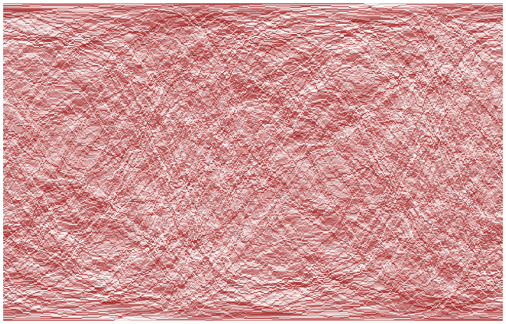
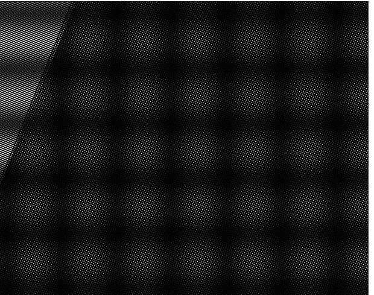
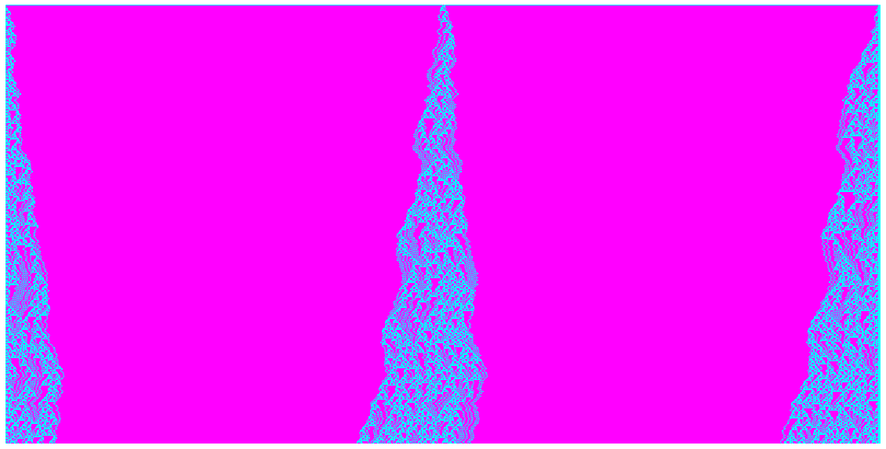

# Mathy things

Miscellaneous musings exploring numbers and patterns. Also contains some forks and cloned notebooks to play around with.

## Stuff I wanted to look at:
- [Mandelbrot](https://www.geeksforgeeks.org/mandelbrot-fractal-set-visualization-in-python/)